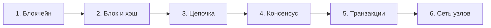
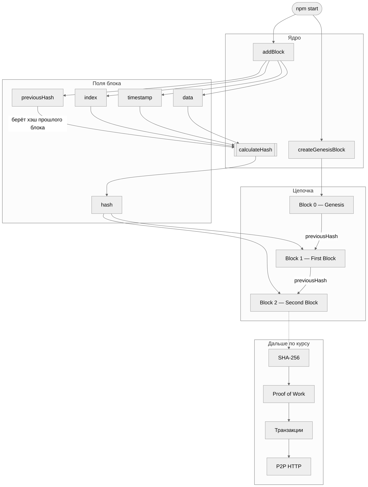
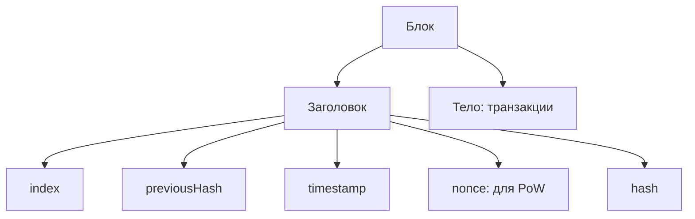

# Конспекты и практические работы по блокчейну

Этот репозиторий — компактный учебный курс по блокчейну и Web3: здесь собраны понятные конспекты, схемы, практические задания и рабочий пример на TypeScript.

Цель курса — не просто выучить термины, а пройти путь от одного блока до понимания сети, хэшей, консенсуса и транзакций.

## Навигация

| Раздел | Содержание |
| --- | --- |
| [`lectures/`](lectures/) | Конспекты лекций, определения, схемы и вопросы для повторения |
| [`practical/`](practical/) | Практические задания от простого к сложному |
| [`src/`](src/) | Рабочие примеры на TypeScript |

Текущая практическая работа — учебный блокчейн на TypeScript: как устроены блоки, цепочка и хэш «под капотом» Web3.

Сейчас это локальная симуляция в одном процессе Node.js — без сети и без настоящего SHA-256. Это сделано специально: сначала разбираемся в идее, затем добавляем сложность шаг за шагом.

Схема: [блокчейн в FigJam](https://www.figma.com/board/tHMlEnG9OvXdJMnViOPMQc).

## Как запустить

Нужны [Node.js](https://nodejs.org/) 18+ и npm.

```bash
git clone https://github.com/azamxvit/blockchain-app.git
cd blockchain-app
npm install
npm start
```

`npm start` сначала компилирует TypeScript (`tsc`), затем запускает `dist/blockchain.js`.

Полезные команды:

| Команда | Что делает |
| --- | --- |
| `npm install` | Ставит TypeScript и типы Node.js |
| `npm run build` | Компилирует `src/` в `dist/` |
| `npm start` | Собирает проект и печатает цепочку в консоль |

Ожидаемый вывод — JSON с тремя блоками: Genesis, First Block, Second Block. Хэши пока выглядят как склейка полей (`index + previousHash + timestamp + data`), а не как SHA-256.

## Карта курса



| Этап | Что изучаем | Результат |
| --- | --- | --- |
| 1 | Распределённый реестр | Понимаем, зачем нужна сеть узлов |
| 2 | Поля блока и хэш | Умеем разобрать блок по частям |
| 3 | Связь блоков | Видим, почему историю трудно изменить |
| 4 | PoW и PoS | Понимаем, как сеть выбирает следующий блок |
| 5 | Транзакции и подписи | Отличаем данные от доказательства авторства |
| 6 | P2P и API | Представляем, как узлы обмениваются блоками |

## Как это работает



1. При старте создаётся **генезис-блок** — нулевой блок с `previousHash = "0"`.
2. Каждый новый блок берёт хэш предыдущего и пишет его в `previousHash`.
3. `calculateHash` склеивает поля блока в строку. Позже заменим это на SHA-256.
4. Цепочка хранится в массиве `chain`. Если изменить данные в середине, хэши перестанут сходиться.

### Из чего состоит блок



`previousHash` связывает текущий блок с предыдущим, а `hash` позволяет проверить, что содержимое блока не изменилось.

Структура блока:

```
Block
├── index          номер в цепочке
├── previousHash   хэш предыдущего блока
├── timestamp      время создания
├── data           полезная нагрузка
└── hash           отпечаток этого блока
```

## Структура проекта

```
blockchain-app/
├── lectures/           конспекты лекций
├── practical/          практические работы
├── src/                исходный код примеров
│   └── blockchain.ts
├── tsconfig.json       настройки компилятора
├── package.json        скрипты запуска
└── README.md           описание курса и проекта
```

## Как вести материалы

- Для каждой лекции создавайте отдельный Markdown-файл в `lectures/`.
- Для каждой практической работы создавайте отдельную папку в `practical/` с кратким README и ссылками на код.
- Примеры, которые можно запустить, храните в `src/` и описывайте в соответствующей практической работе.

## Правила хорошего конспекта

- Сначала объясняйте идею простыми словами, затем добавляйте термин.
- Для каждого нового поля или алгоритма приводите маленький пример.
- Отделяйте факт из лекции от собственной гипотезы или вопроса.
- После конспекта оставляйте 3–5 вопросов, на которые можно ответить без подсказки.

## Открытые источники

- [Bitcoin whitepaper](https://bitcoin.org/bitcoin.pdf) — оригинальное описание Bitcoin и PoW.
- [Ethereum documentation](https://ethereum.org/en/learn/) — базовые материалы об Ethereum и PoS.
- [MDN Web Crypto API](https://developer.mozilla.org/en-US/docs/Web/API/Web_Crypto_API) — справка по криптографическим API в JavaScript.

## Куда идём дальше

По гайдам Eddie / Savjee / freeCodeCamp:

1. Настоящий SHA-256 вместо склейки строк.
2. Proof of Work: подбор `nonce`, пока хэш не начнётся с нулей.
3. Транзакции, награды майнерам и подписи ECDSA (`elliptic`).
4. Express API и обмен блоками между несколькими терминалами.

Стек, к которому идём: TypeScript, `crypto` / `crypto-js`, `elliptic`, Express, WebSockets.
