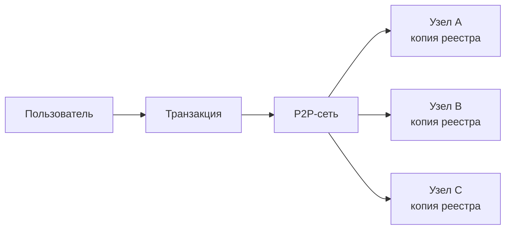
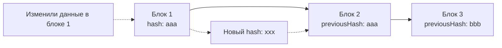

# Лекция 1. Что такое блокчейн?

> Блокчейн — это распределённая база данных, в которой информация хранится в последовательных блоках, связанных криптографически.

## Идея в двух словах

Блокчейн позволяет нескольким участникам хранить и проверять общую историю записей без единого центра, которому все должны безоговорочно доверять.

```text
Транзакции -> Блок -> Хэш блока -> следующий блок
                 ^                    |
                 +-- хэш предыдущего -+
```

### Одна сеть, много копий



Узлы не обязаны быть одинаковыми по железу, но должны проверять записи по одним правилам.

## Главные свойства

| Свойство | Что означает | Зачем нужно |
| --- | --- | --- |
| Децентрализация | Копии реестра хранятся на множестве узлов | Нет одной точки отказа |
| Прозрачность | Участники могут проверять историю операций | Проще проводить аудит |
| Неизменяемость | Изменение старой записи нарушает связанные хэши | Сложнее подделать историю |
| Криптографическая защита | Используются хэши и цифровые подписи | Подтверждаются целостность и авторство |

## Как это работает

1. Пользователь создаёт транзакцию.
2. Сеть проверяет её корректность.
3. Проверенные транзакции объединяются в блок.
4. Блок получает ссылку на предыдущий блок и добавляется в цепочку.
5. Узлы сети обновляют свои копии реестра.

### Почему изменение заметно



После изменения блока 1 его новый хэш больше не совпадает с `previousHash` блока 2. В реальной сети злоумышленнику пришлось бы пересчитать и согласовать все последующие блоки.

## Важное уточнение

Блокчейн не делает данные «магически истинными». Он помогает доказать, что запись не была незаметно изменена после добавления. Достоверность исходных данных всё равно зависит от участников и правил сети.

## Термины

- **Узел (node)** — компьютер, участвующий в хранении или проверке реестра.
- **Транзакция** — запись о действии в сети.
- **Блок** — набор транзакций и служебных данных.
- **Хэш** — короткий цифровой отпечаток данных.
- **Распределённый реестр** — общая база данных без единого владельца.

## Связь с практикой

В [учебном примере блокчейна](../../src/blockchain.ts) каждый блок содержит `index`, `previousHash`, `timestamp`, `data` и `hash`. Поле `previousHash` связывает блоки в цепочку. В текущей версии хэш упрощён и представлен склейкой строк; позже его можно заменить на SHA-256.

## Вопросы для повторения

1. Чем блокчейн отличается от обычной базы данных?
2. Что произойдёт с цепочкой, если изменить данные внутри старого блока?
3. Зачем каждому блоку нужен хэш предыдущего блока?
4. Какие задачи решают децентрализация и цифровая подпись?

Следующий шаг: [практическая работа 1](../../practical/01-blockchain-basics/README.md).