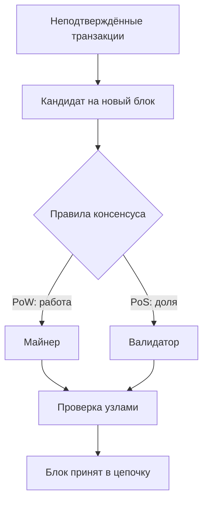

# Лекция 2. Принципы работы блокчейна и консенсус

## Главное

Блокчейн — это не только цепочка записей, но и набор правил, по которым узлы решают, какой блок считать следующим корректным блоком. Эти правила образуют **алгоритм консенсуса**.

## Из чего состоит блок

| Часть | Содержимое |
| --- | --- |
| Заголовок | Хэш предыдущего блока, временная метка, сложность, `nonce`, корневой хэш дерева Меркла |
| Тело | Список подтверждённых транзакций |

Ссылка на хэш предыдущего блока создаёт зависимость между блоками. Если изменить транзакцию в старом блоке, изменится его хэш, а затем перестанут совпадать ссылки во всей последующей цепочке.

## Что такое консенсус

**Консенсус** — способ договориться о состоянии реестра в распределённой сети.

Хороший алгоритм консенсуса должен обеспечивать:

- целостность данных;
- устойчивость к сбоям и атакам;
- отсутствие единого центра принятия решений;
- приемлемые скорость и масштабируемость.



## Proof of Work (PoW)

Майнеры перебирают значение `nonce`, пока хэш блока не удовлетворит условию сложности, например не начнётся с заданного количества нулей.

```text
изменить nonce -> вычислить хэш -> условие выполнено?
                         | нет          | да
                         +-- повторить  +-- передать блок сети
```

**Плюсы:** высокая проверяемость и защита от подделок.  
**Минусы:** большие энергозатраты, ограниченная скорость и риск концентрации майнинга в пулах.  
**Пример:** Bitcoin.

## Proof of Stake (PoS)

В PoS право создать следующий блок связано с долей участника (`stake`) — количеством заблокированных монет. Валидатор рискует залогом: за нарушение правил возможен `slashing`.

**Плюсы:** энергоэффективность, высокая скорость, экономическая мотивация действовать честно.  
**Минусы:** риск влияния крупных держателей и необходимость сложных правил выбора валидатора.  
**Пример:** Ethereum после The Merge.

## Другие подходы

| Алгоритм | Как выбирается участник | Где уместен |
| --- | --- | --- |
| DPoS | Пользователи голосуют за делегатов | Сети с высокой пропускной способностью |
| PBFT | Ограниченный набор узлов обменивается сообщениями | Приватные и корпоративные сети |
| PoA | Блоки создают доверенные валидаторы | Закрытые сети и консорциумы |
| Hybrid | Комбинируются несколько механизмов | Когда нужен баланс свойств |

## PoW и PoS: короткое сравнение

| Критерий | PoW | PoS |
| --- | --- | --- |
| Главный ресурс | Вычислительная мощность | Заблокированные активы |
| Участник | Майнер | Валидатор |
| Энергозатраты | Высокие | Существенно ниже |
| Основной риск | Концентрация майнинга | Концентрация капитала |

### Что важно не перепутать

- **Хэш** проверяет целостность данных, но сам по себе не выбирает правильную цепочку.
- **Консенсус** помогает узлам договориться, какой блок принять.
- **Цифровая подпись** доказывает, что транзакцию создал владелец ключа.
- **Шифрование** скрывает данные, а в публичном блокчейне транзакции чаще проверяемы, а не секретны.

## Связь с практикой

Текущий код создаёт цепочку и связывает блоки через `previousHash`. Следующий логичный шаг — добавить `nonce`, настоящий SHA-256 и проверку сложности, чтобы превратить простую симуляцию в минимальный пример PoW.

## Вопросы для повторения

1. Почему изменение старого блока влияет на последующие блоки?
2. Чем майнер отличается от валидатора?
3. Какую задачу решает `nonce` в PoW?
4. Почему PoS экономит энергию, но может усиливать влияние крупных держателей?
5. Для каких сетей разумнее выбрать PBFT или PoA?

Следующий шаг: [практическая работа 2](../../practical/02-hashing-and-consensus/README.md).