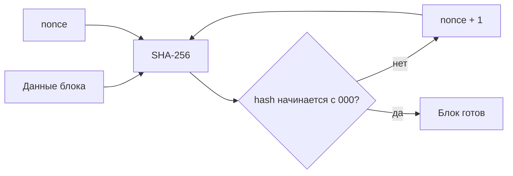

# Практическая работа 2. Хэширование и Proof of Work

## Цель

Заменить учебную склейку строк на SHA-256 и добавить минимальную модель Proof of Work.

## Задания

1. Используйте встроенный модуль Node.js `crypto` и `createHash('sha256')`.
2. Хэшируйте фиксированное представление полей блока.
3. Добавьте `nonce` и параметр `difficulty`.
4. Реализуйте перебор nonce, пока хэш не начнётся с нужного количества нулей.
5. Измерьте время майнинга для сложности 2, 3 и 4.
6. Объясните, почему проверка найденного nonce быстрее, чем его поиск.

## Схема

## Вопросы

- Почему изменение одного символа полностью меняет хэш?
- Что произойдёт со временем майнинга при увеличении сложности?
- Почему PoW не делает данные секретными?

## Ограничение

Это учебная модель. Она не заменяет полноценную криптовалютную сеть: здесь нет сетевого обмена, подписей, защиты от повторной транзакции и экономической модели.